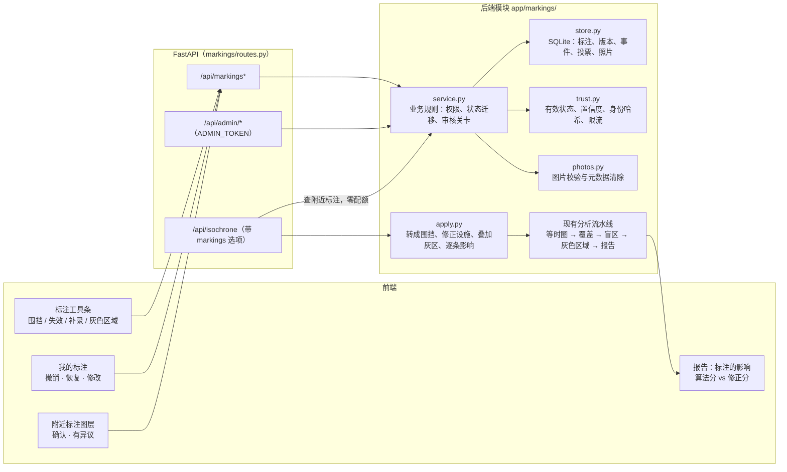
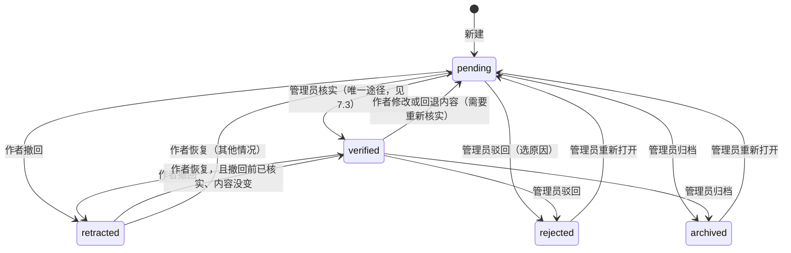
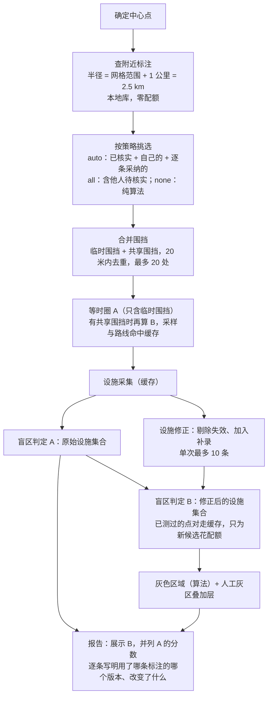

# 用户标注与灰色区域识别升级：设计方案

> 状态：第 4~10 节的用户标注（一、二期）**已实现**，第 11 节的算法升级**尚未实现**。
> 正文已按最终实现修订；和最初设计不一样的地方，以及第 15 节各个问题的结论，见第 15 节。
> 本文回答三个问题：用户标注怎么存、怎么撤销、怎么被下一个用户用上；灰色区域的识别算法还能怎么改进；分几期做，每期做到什么程度。

## 1. 结论

- 想法可行，而且补的正是算法最弱的一环。乡镇地区百度 POI 漏录、过时，路网缺小路，算法再准也只能在错的输入上算出错的结论。用户是唯一能低成本纠正输入的来源。
- 最重要的原则：**让用户标"原因"，而不只是标"结论"**。
  - "这里缺药店"是结论，换一个中心点、换一种网格就用不上。
  - "这家药店已经关门""这条路被围挡封了"是原因。任何人、以任何中心点做分析都能直接吃进去重算。
  - 人工灰色区域仍然保留，作为"带理由的结论"；能转成原因的，引导用户转成原因。
- 共享的标注**不静默生效**。
  - 自己的标注马上对自己生效。
  - 别人的、未经核实的标注只作为"建议"出现，当前用户可以逐条采纳，只影响自己这次分析。
  - 只有**管理员审核核实**的标注才对所有人自动生效。投票只是信号，不会让标注自动生效。
  - 管理员核实**不能一键完成**：要打开详情、看完照片、逐项确认、写明依据（见 7.3）。
  - 标注可以附现场照片，作为核实依据；上传时去掉定位等元数据（见 7.4）。
  - 报告同时给"算法结果"和"含标注修正的结果"，写明差多少、差在哪几条标注上。
- 撤销用**事件日志 + 软删除**实现。每次分析都记下用了哪几条标注的哪个版本，结果可追溯、可复现。
- 配额开销小。
  - 查附近标注是本地数据库操作，零配额。
  - 重算时路网点对有磁盘缓存，只有新增的候选才花配额。
- 算法方面，命题口径"步行 1 公里内有没有菜场、药店、小学"保留为主判定，在它之上分层改进：
  - 近期：按"缺什么、为什么"分片，连续的缺口程度，数据可信度层；
  - 中期：人口加权、自适应加密、算法与标注的贝叶斯融合；
  - 长期：高斯两步移动搜索法（G2SFCA）、空间约束聚类。

## 2. 为什么需要用户标注

| 现实情况 | 算法看到的 | 结果 | 需要的标注 |
| --- | --- | --- | --- |
| 村卫生室、社区菜点没被百度收录 | 附近没有这类设施 | 假灰：本来不缺，被标成灰色 | 补录设施 |
| 药店已关门但 POI 还在；学校不对外招生 | 有设施 | 漏灰：真的缺，没标出来 | 设施失效 |
| 施工围挡、临时封路 | 路线照常穿过 | 漏灰 | 围挡（已有，但不保存、不共享） |
| 封闭小区、被封的涵洞、地图上有但走不通的路 | 可达 | 漏灰 | 永久阻隔 |
| 田间小路、便桥，地图上没有 | 绕远，或测距失败 | 假灰，或"未知" | 缺失步道（难，见 4.5） |
| 设施在，但学位已满、只开半天 | 有设施 | 漏灰（服务能力不足） | 人工灰色区域 + 理由 |

做这个功能之前：围挡只随一次请求提交（`IsochroneRequest.closures`），存在那次结果里，别的用户看不到；其余几类没有入口。复测巡检和工地 POI 找到的疑似点，确认后也只进本次计算。

## 3. 设计原则

1. **标原因优先。** 原因可以跨中心点复用，也能直接进入重算；结论不能。
2. **算法结果始终保留。** 标注是叠加层。命题要求"自动标注"，算法这一层必须能单独拿出来看、单独打分。
3. **信任分级。** 自己的标注马上对自己生效；别人的，管理员核实后才自动生效，未核实的只作建议。
4. **撤销不是删除。** 所有变更记事件，状态由事件推出。被撤回的标注仍可追溯"当时谁的分析用过它"。
5. **零配额优先。** 查询、状态判断、叠加全在本地；需要测距的，先查缓存，再按预算花配额，超出预算就估算并标注。

## 4. 标注类型

| 类型 | 几何 | 对计算的影响 | 默认有效期 | 额外配额 |
| --- | --- | --- | --- | --- |
| `closure` 围挡 / 封路 / 阻隔 | 圆（10~300 米），二期支持折线 | 与现有围挡相同：射线截断、围挡内设施不可用、可达点对核验 | 施工 60 天；封闭小区、永久阻隔 365 天 | 在现有 80 条核验预算内 |
| `facility_missing` 设施失效 | 指向一条 POI | 从设施集合里剔除，受影响品类重新判定 | 180 天 | 只有新增候选的点对 |
| `facility_extra` 补录设施 | 点 + 品类 + 名称 | 加入设施集合（标"用户补录"），附近缺该类的格子测距 | 180 天 | 每处不超过圈内格数（样例 116~144） |
| `gray_area` 人工灰色区域 | 多边形（不超过 50 个顶点、400 m²~1 km²、跨度不超过 3 km） | 叠加层，不改变算法判定；报告写明区域内几格算法也判为缺失（融合见 11.6，未实现） | 365 天 | 0 |
| `path_missing` 缺失步道 | 折线 | 三期研究项，未实现 | — | 较多 |

- 补录设施的点对上限：网格只铺在 15 分钟圈内、100 米一格（样例 116~144 格），一处补录最多测这些格子；
  只测其中缺这一类、且直线 1 公里内的，通常更少。（旧版 1.5 公里 / 200 米网格时是约 π·1000²/200² ≈ 78 格。）
- 有效期可以在 7~365 天之间自定；到期前作者可以续期。
- 四种类型都**必须**附至少一张现场照片（7.4）。

### 4.1 围挡 `closure`

- `kind` 取值：`construction`（施工）、`road_closed`（临时封路）、`gated`（封闭小区、门禁）、`barrier`（地图上有、实际走不通的路）。它决定有效期和图例。
- **提交时就地检查（零配额）。** 拿当前结果里存的 36 条路线基线（`rays[].route_path`）和围挡圆求交，马上告诉用户"这处围挡会挡住 2 个方向的步行路线"或"它不在任何一条路线上，对等时圈没有影响"。用户能当场判断自己标得对不对。
- 与现有功能打通：复测巡检的疑似点、工地 POI 候选旁边各有一个"共享"按钮，点了打开共享标注表单，预填位置与半径，`source` 分别记为 `recheck` / `poi`。原来的"确认为围挡"仍然只进本次计算，不共享。
- **已实现**：就地检查在前端做（`circleHitsPath`），提交前显示"会挡住 N 个方向"；结果里没存路线基线时如实提示"提交后重新计算才能看到影响"。

### 4.2 设施失效 `facility_missing`

- 引用一条 POI：品类、名称、坐标。
- 匹配规则沿用 `collect.py` 的去重口径：同品类、归一化名称相同、相距 50 米内。不用 uid，`collect.py` 已经说明多关键词召回下 uid 并不稳定。
- 理由：`closed`（已关闭）、`not_public`（不对外，如寄宿制、单位内部医务室）、`wrong_location`（位置错了）、`wrong_category`（品类错了，如"小学生辅导班"）。
- 表单里列出当前结果中这个位置附近的设施，点选即填好品类、名称、坐标。
- 分析时的匹配：先找同名且 50 米内的 POI，找不到再取 15 米内最近的一家；剔除后报告写明"剔除了「某某药店」"。
- 百度那边这条 POI 已经消失时，这条标注在本次分析中跳过，写明"地图上已找不到这家设施"。
- **未实现**：
  - `wrong_location` 顺手给出正确位置、拆成"失效 + 补录"两条；现在要分别提交。
  - POI 消失后自动归档。分析过程不写标注库（见第 8 节），归档留给管理员处理。

### 4.3 补录设施 `facility_extra`

- 点 + 品类 + 名称 + 现场照片（必填）。
- 分析时如果 50 米内已检索到同品类、名称相近的 POI，这条补录在本次分析中跳过，写明"地图已收录「某某」，不重复计算"，避免同一设施算两次。
- 补录的设施在地图上画成虚线描边的点，图例写"用户补录"，结果里带 `source: "user"` 与 `marking_id`。
- 与 AI 二次核对打通：灰色区域卡片里 Agent Plan 找到的「疑似漏收录」设施旁有"共享为补录标注"，
  点了打开补录表单，位置、类别、名称都带好，标注的 `source` 记为 `agent_plan`；现场照片照样必填。
- **未实现**：地图收录后自动归档（理由同 4.2）。

### 4.4 人工灰色区域 `gray_area`

- 提交时先问"为什么缺"，按回答引导：
  - "设施关了 / 不对外" → 请用户点地图上那家设施 → 转成 `facility_missing`；
  - "路走不通" → 请用户画围挡 → 转成 `closure`；
  - "设施在、但不够用"（学位满、营业时间短）→ 保留为 `gray_area`，理由 `capacity`；
  - "在分析范围外" → 保留为 `gray_area`，理由 `outside_grid`；
  - 其他 → 保留，理由 `other`，附文字说明。
- 这就在"路网阻隔 / 供给缺口"之外引入了第三种成因：**服务能力不足**。算法从 POI 永远看不出这一类，只能靠人。
- **已实现**：表单第二步"为什么缺"按上面的规则引导，另加一项 `quality`（服务质量差）。多边形在前端逐点绘制，可撤销 / 重做每一个顶点，提交前就地检查自相交与面积。

### 4.5 缺失步道 `path_missing`（研究项）

- 难点：百度路线规划不能加边，没法让它"知道"这条便道。
- 近似做法：对可能受益的点对（便道两端 P1、P2 落在该点对的椭圆范围内），取

  `d' = min(d(A,B), d(A,P1) + |P1P2| + d(P2,B))`

  每个点对多两段测距，只对受影响的少数点对做。
- 放到三期，先看一二期的标注里这类需求有多少。

## 5. 总体架构



## 6. 数据与存储

**位置：`data/user/`**，可用环境变量 `MARKINGS_DIR` 改。

- `markings.db`：SQLite，开 WAL；写操作一律 `BEGIN IMMEDIATE`，修改带版本号做乐观并发。
- `photos/`：照片文件，按 32 位随机十六进制 ID 命名，不含任何用户信息。
- `salt`：没配 `MARKING_SALT` 时自动生成的哈希盐。丢了它，所有人都会失去"我的标注"（设备哈希对不上），所以要和数据库一起备份。
- 不放 `.cache/`：那里是可再生的缓存，用户可能随手清掉；标注是用户数据，丢了找不回来。
- `.gitignore`、`.dockerignore` 排除 `data/user/`；`docker-compose.yml` 挂卷 `./data/user:/app/data/user`。
- 现在的分析历史 `analyses.db` 也在 `.cache/` 里，同样的问题，可以顺带迁移（不在本方案范围内）。

实际的表（`store.py`，节选）：

```sql
CREATE TABLE markings (
  id           INTEGER PRIMARY KEY AUTOINCREMENT,
  type         TEXT NOT NULL,     -- closure / facility_missing / facility_extra / gray_area
  kind         TEXT,              -- closure 的种类
  category     TEXT,              -- 设施品类
  spec         TEXT NOT NULL,     -- 权威内容（JSON）：位置、半径、名称、理由、多边形、说明
  geometry     TEXT NOT NULL,     -- 由 spec 推导的 GeoJSON，BD09，[经度, 纬度]
  lat REAL NOT NULL, lng REAL NOT NULL,             -- 代表点
  min_lat REAL NOT NULL, max_lat REAL NOT NULL,     -- 外接框，邻近查询用
  min_lng REAL NOT NULL, max_lng REAL NOT NULL,
  note         TEXT NOT NULL DEFAULT '',
  source       TEXT NOT NULL,     -- user / recheck / poi / agent_plan（AI 二次核对）
  status       TEXT NOT NULL,     -- pending / verified / rejected / retracted / archived
  version      INTEGER NOT NULL DEFAULT 1,
  author_hash  TEXT NOT NULL,     -- sha256(盐 + 设备 ID)
  edit_hash    TEXT NOT NULL,     -- sha256(编辑令牌)
  confirms     INTEGER NOT NULL DEFAULT 0,
  disputes     INTEGER NOT NULL DEFAULT 0,
  created_at TEXT NOT NULL, updated_at TEXT NOT NULL,
  expires_at TEXT NOT NULL, reviewed_at TEXT
);

-- 每个版本一份完整 spec；回退 = 把旧版内容写成新版本
CREATE TABLE marking_versions (marking_id, version, spec, created_at, PRIMARY KEY (marking_id, version));

-- 只追加：新建、修改、回退、撤回、恢复、续期、投票、照片、审核都记在这里
CREATE TABLE marking_events (id, marking_id, action, actor, actor_hash, payload, created_at);

-- 每台设备对每条标注一票（+1 确认 / -1 有异议），可改票、撤票
CREATE TABLE marking_votes (marking_id, voter_hash, vote, created_at, PRIMARY KEY (marking_id, voter_hash));

-- 照片元数据；status = visible / hidden（管理员隐藏）/ deleted（文件已删）
CREATE TABLE marking_photos (id, marking_id, uploader_hash, role, mime, bytes, width, height,
                             sha256, status, created_at);
```

- 和最初设计的区别：
  - 内容统一存进 `spec`，其余列都由它推导，比较"改没改"、存版本、回退都只认 `spec`；
  - "有争议"与"已过期"不是存下来的状态，而是读取时算出来的（7.1）。
- **邻近查询**：先用 bbox 索引粗筛，再在 Python 里按真实几何精筛（落在围挡圆或区域内算 0 米）。几千到几万条的规模足够。
- **升级路径**：多实例部署或数据量上到十万级时，换 PostgreSQL + PostGIS（`ST_DWithin` + GiST 索引），接口不变。

一条标注在接口里的样子（节选）：

```json
{
  "id": 12,
  "type": "closure",
  "title": "施工围挡 · 半径 60 米",
  "status": "verified",
  "spec": {"type": "closure", "kind": "construction", "lat": 31.286, "lng": 121.371,
           "radius_m": 60, "note": "景泰路西段围挡"},
  "source": "recheck",
  "version": 1,
  "confirms": 2,
  "disputes": 0,
  "disputed": false,
  "confidence": 0.917,
  "my_vote": 0,
  "photo_count": 2,
  "mine": false,
  "created_at": "2026-09-20T09:12:00+08:00",
  "expires_at": "2026-11-19T09:12:00+08:00",
  "review": {"decision": "verify", "basis": ["现场照片", "实地走访"],
             "note": "照片清楚，路口确有围挡", "at": "2026-09-21T10:00:00+08:00"},
  "distance_m": 420
}
```

## 7. 生命周期、信任与撤销

### 7.1 状态



**状态规则**（`trust.py`、`service.py`）

- 新建即 `pending`，**对作者本人的设备立即生效**，作者马上能看到效果。
- **只有管理员审核能把标注变成 `verified`**。
  - 最初设想的"2 台其他设备确认就生效"没有采用：没有账号时，换个设备 ID 就能多投一票，靠票数自动生效等于谁都能让自己的标注对所有人生效。
  - 投票只影响置信度、排序和"有争议"提示，并把有争议的标注排到审核队列前面。
- 两个读取时算出来的标记，不写库、不跑定时任务：
  - **已过期** `expired`：待核实 / 已核实的标注过了 `expires_at`，不再参与计算。作者可以续期；管理员核实过期标注时必须重新设定有效期。
  - **有争议** `disputed`：异议 ≥ 确认 + 2。只是提示，状态不变。
- 已核实的标注被作者改了内容（修改或回退），自动回到 `pending`，时间线写明"内容变了，需要重新核实"。只续期不改内容，不影响核实状态。
- 撤回、驳回的标注不再对其他人展示（详情与照片都返回 404），作者自己仍能看到。
- 和最初设计的区别：作者撤回一律进 `retracted`，不再"已有他人确认就转回 pending"。作者撤回后，确认过的人可以自己再标一条。

**置信度**（排序与展示用，不决定是否生效）

- 公式：`c = (a + 确认) / (a + b + 确认 + 异议)`，先验 `(a, b)` 按来源取：
  - 普通用户 (1, 1)，初始 0.5；
  - 工地检索 (1.5, 1)；
  - AI 二次核对 (1.5, 1)：Agent Plan 找到、又有人到现场拍了照的补录；
  - 复测巡检 (2, 1)；
  - 已核实 (9, 1)。
- 围挡类在有效期的最后 20% 里线性打折，到期时降到七成：施工与封路会结束，临近到期越来越不可信。

### 7.2 撤销

- **提交前**：画图中的每一步（选点、改半径、加顶点）有本地的撤销 / 重做栈（`draft.ts`），不经过服务器。
- **提交后 10 秒内**：底部提示条"已提交 · 撤回"，点一下即撤回。
- **任何时候**：侧栏"我的标注"可以撤回、恢复、修改、续期。
  - 修改产生新版本；
  - 可以回到任意旧版本，回退本身也产生一个新版本，不会抹掉历史；
  - 修改带版本号，两个页面同时改同一条时，后提交的收到 409"请刷新后再操作"，不会悄悄覆盖。
- 别人的标注不能删，只能"有异议"。
- 分析结果的 `markings.applied` 记下每条标注的 `id + version`，结果可追溯。
- **未实现**：重新打开历史结果时提示"所用标注 #12 已撤回"。现在只在打开不含标注信息的结果（样例、旧历史）时，提示"附近有 N 条共享标注，这份结果还没有计入"，可一键按标注重算。

### 7.3 管理员审核：刻意不能一键核实

核实一条标注等于让它对附近所有人生效，所以每一步都要求管理员真的看过：

1. **先打开详情。** `GET /api/admin/markings/{id}` 时，服务端按"标注 + 管理员设备"记下打开时刻与当时的版本。别的设备打开过不算数。
2. **停留时间。** 核实请求必须在打开后 5 秒到 2 小时之间到达。前端按钮上有倒计时。
3. **内容没变。** 打开之后作者改过内容，核实被拒（`review_stale` / 409），要重新打开。
4. **逐项确认。** 位置准确、类型与描述相符、目前仍然有效，三项都要勾。
5. **核实依据。** 在"现场照片 / 实地走访 / 官方信息 / 多人确认"里至少选一项：
   - 选了"现场照片"，这条标注就必须有照片，且每一张可见照片都要点开看过（前端记录，服务端核对 `photos_reviewed`）；
   - 选了"多人确认"，确认人数至少 2 人。
6. **审核意见。** 至少 6 个字，说明依据什么做的判断；核实后公开显示在标注详情里。
7. **不能自审。** 不能核实自己这台设备提交的标注；核实请求必须带设备标识。
8. **二次确认。** 前端提交前再弹一次确认框，写明后果："核实后，附近所有用户分析时都会自动计入这条标注"。

- 驳回要选原因（位置或内容不准确 / 重复标注 / 现场已经不是这样 / 内容不当 / 其他）并写意见；归档、重新打开也要写意见。
- 审核队列分待核实、有争议、已过期、已核实、已驳回、已归档、已撤回；有争议的、带照片的、等得久的排前面。
- 审核详情比公开详情多：每一票的记录、每个版本的完整内容、提交者的历史（共提交几条、几条核实、几条驳回）、已隐藏的照片。
- 管理员可以隐藏 / 恢复单张照片（要写原因），比如照片拍到了人脸或车牌。
- 打开记录存在进程内存里：后端重启后要重新打开详情。

### 7.4 照片

- **必填**（2026-10-01 起）：新建时至少附一张。没有照片的标注管理员无从核实。
  - 先传后建：照片先 `POST /api/markings/uploads`，拿到预传 ID；新建时带上 `photos: [...]`，
    服务端在新建的同一个事务里把照片挂上标注（存在 `photo_uploads` 表，文件已在 `photos/` 下，只挪一行）。
    有一张对不上（不是这台设备传的、已过期、已被用过）整个新建回滚，标注不会建出来。
  - 被提示"附近已有同类标注"后坚持提交，可以直接复用刚才的预传 ID，不必重传。
  - 预传照片一小时内没用上，下次有人上传或新建时连文件一起清掉；每台设备同时最多挂 12 张。
  - 作者不能删掉最后一张可见照片（可以先补一张再删，或撤回整条）；其他人删自己补充的照片不受限制——照片可能拍到了人，删除的权利不能被绑住。
  - 这之前建的、没有照片的旧标注照常保留，审核时依据不能选"现场照片"。
- **上传**：请求体就是图片原始字节，不用 multipart，也不引入新依赖。新建前走 `/api/markings/uploads`，补充照片走 `POST /api/markings/{id}/photos`。
  - 作者（带编辑令牌或同一设备）和其他用户都能补充照片，分别标"提交者拍摄""其他用户补充"；
  - 每条最多 6 张，每人每条最多 3 张，同一张不能重复传；数量在写库事务里检查，并发上传也不会超。
- **前端预处理**：长边缩到 1600 像素，用 canvas 重新编码成 JPEG。这一步本身就丢掉了原图的 EXIF。上传有进度条。
- **服务端清洗**（`photos.py`，纯 Python，不依赖 Pillow），不信任前端：
  - 只收 JPEG / PNG / WebP，按文件头判断格式，不看扩展名；不超过 4 MB，边长 16~8000 像素；
  - JPEG 删掉 APP1（EXIF / XMP，含 GPS 定位）、APP3~APP13、APP15 和注释段，保留 APP0、APP2（色彩配置）、APP14；
  - PNG 校验每个块的 CRC，删掉 eXIf、tEXt、zTXt、iTXt、tIME；
  - WebP 删掉 EXIF、XMP 块，并清掉 VP8X 里对应的标志位。
- **存储与访问**：文件名是随机 ID；标注撤回或驳回后，照片不再公开访问（管理员仍能看）；删除照片时连文件一起删，不留副本。
- nginx 的 `client_max_body_size` 设为 5m，比 4 MB 上限略大。

### 7.5 身份与防滥用

- **没有账号体系，现阶段对任何人开放。**
  - 设备 ID 用 `crypto.randomUUID()` 存在 localStorage，请求头 `X-Device-Id` 带上，服务端只存加盐哈希。
  - 每条标注在创建时返回一次性编辑令牌（32 字节随机数），浏览器存在 localStorage，服务端只存哈希；修改、撤回、恢复都要出示它。
  - 用户清掉浏览器数据就失去修改能力，只能找管理员处理。
- **这不是真正的认证。** 写接口实际上对任何人开放，公开部署前必须加登录（手机号、微信）和人机验证。比赛演示阶段可以接受，但要在文档和答辩里说明。
- **限流**（每小时，每设备 / 每 IP；进程内存滑动窗口，多实例部署需要 Redis）：
  - 新建 20 / 40，修改 60 / 120，投票 100 / 200，照片 30 / 60；
  - 管理员口令同一 IP 10 分钟内输错 10 次就锁 10 分钟，锁定期间口令对了也不放行。
- **几何校验**：
  - 坐标落在中国范围内（填反经纬度会被拦下）；
  - 圆半径 10~300 米；
  - 多边形 3~50 个顶点、400 m²~1 km²、跨度不超过 3 km、不自相交、没有折返的尖角。
- **去重**：同类标注附近已有一条时返回 409 和那一条，前端提示"去确认它比再建一条更有用"，用户仍可坚持提交。
  - 围挡、补录设施、人工灰区：30 米内（灰区还要缺的品类有交集）；
  - 设施失效：同品类、归一化名称相同、50 米内。
- **文字**：说明不超过 60 字，设施名称不超过 30 字；去掉控制字符与零宽字符，网址替换成"［链接已移除］"，手机号、座机号替换成"［号码已移除］"；前端一律按文本渲染。
- **公开范围**：公开时间线只显示确认 / 异议的计数，不列逐票记录。
- **管理员**：`.env` 里配至少 12 位的 `ADMIN_TOKEN` 才开放审核接口，不配则返回 503。口令在前端只存在 sessionStorage，关掉标签页就没了；`/api/config` 只告诉前端审核开没开，不下发口令。

## 8. 分析流水线怎么用标注

这就是"下次别的用户使用时，先算附近有没有标注，有就相应处理"的具体做法。



1. **查询半径**：2.5 km，和设施检索半径一致（1.5 km 加判定阈值 1 km）。网格现在只铺在 15 分钟圈内，圈的最远处不超过 1.5 km，所以这个半径仍然罩得住：在这之外的标注不可能影响结果。
2. **选择策略** `markings.mode`：
   - `auto`（默认）：已核实的 + 自己的，外加 `include` 里逐条采纳的建议；
   - `all`：连他人待核实的也用；
   - `none`：纯算法，附近的标注全部列为建议；
   - `exclude` 可以逐条排除，写进 `skipped`。
   - 采纳只影响这一次分析，不改变标注本身的状态，也不算投票。
3. **围挡合并**：
   - 请求里的围挡与共享围挡合并，20 米内去重。
   - 上限沿用 `MAX_CLOSURES = 20`，优先级：自己的 > 已核实 > 置信度高 > 离中心近。
   - 超出的写进 `skipped`，注明"超出围挡上限"。
   - 上限不放宽，因为盲区的围挡核验预算（80 条路线）是按它算的。
   - 骑行 / 驾车分析不叠加围挡与人工灰区（围挡与网格只对步行计算），写进 `skipped`；设施类照常叠加。
4. **两个结果**：
   - 结果 A = 算法 + 本次请求里用户自己画的临时围挡，也就是没有这个功能时的行为；
   - 结果 B = A + 要用的共享标注。页面展示 B，`markings.baseline` 存 A 的分数、等级、面积、盲区格数和灰色区域数。
   - 没有会改变输入的标注时（最常见的情况）B 就是 A，只算一遍，零额外开销。人工灰区只是叠加层，不触发重算。
   - 共享围挡不写进 `props.closures`，那个字段只放这次请求的临时围挡，两者在界面上分开显示。
5. **等时圈**：有共享围挡时先算 A 的圈，再按合并后的围挡算 B 的圈。第二遍的采样点与路线都命中缓存，只是按新的围挡重新截断射线。A 的圈存进 `baseline.ring`，地图上画成点线，和 B 对比。
6. **设施修正与测距成本**：
   - 先算 A，再算 B；
   - B 用到的点对只要 A 测过就命中磁盘缓存（30 天），所以只有补录设施和失效设施的"下一家候选"才花配额；
   - 单次最多叠加 10 条设施类标注，超出的写进 `skipped`。
   - **未实现**：最初设想的"标注测距预算 300 个点对，超出用估算"。现在靠 10 条上限控制开销。
7. **灰色区域**：算法灰色区域在 B 的网格上计算；人工灰区作为叠加层，报告写明"区域内 N 个方格，其中 M 格算法也判为缺失"。和算法结果的融合（11.6）未实现。
8. **逐条影响**（`apply.compute_effects`，零配额）：
   - 围挡：挡住几个方向的步行路线，圈内几处设施视为暂不可用；
   - 设施失效 / 补录：对比 A、B 两张网格，几格不再缺、几格变为缺（只看设施 1 公里内的格子）；没算网格时退化为"圈内由 N 处变为 M 处"；
   - 人工灰区：见上一条。
9. **报告与来源**，写进结果 `properties.markings`：

   ```json
   "markings": {
     "mode": "auto",
     "query_radius_m": 2500,
     "nearby_count": 3,
     "applied":   [{"id": 12, "version": 1, "type": "facility_extra", "status": "pending",
                    "mine": true, "effect": "26 格不再缺医药"}],
     "suggested": [{"id": 15, "type": "closure", "status": "pending", "confidence": 0.5}],
     "skipped":   [{"id": 9, "reason": "地图已收录「某某药店」，不重复计算"}],
     "baseline":  {"total": 26.3, "grade": "…", "area_km2": "…", "blind_cells": "…",
                   "gray_regions": "…", "ring": null},
     "effect":    {"score_algorithm": 26.3, "score_with_markings": 27.0, "score_delta": 0.7,
                   "blind_cells_delta": "…", "area_delta_km2": "…", "gray_regions_delta": "…"}
   }
   ```

   示意：分数与"26 格不再缺医药"取自一次端到端测试（补录一家药店），其余数值省略。

   - 保存到历史的是完整结果，这份来源信息一并保存；
   - 导出的报告多一节"用户标注"，列出每条标注、状态、版本和影响。
10. **分析过程不写标注库**：只读，不自动归档、不自动记异议。分析是高频、可重放的操作，让它改共享数据会让结果互相影响、难以复现。
11. **样例与历史不改写**：打开不含标注信息的结果时，如果附近有已核实或自己的标注，横幅提示"这份结果还没有计入"，一键按标注重算。

**和现有功能形成闭环**

- **已实现**：复测巡检的疑似点、工地 POI 候选，可以一键转成共享围挡（4.1）。
- **未实现**（都要在分析时写库，和第 10 条冲突，留给管理员或后续的离线任务）：
  - 复测发现穿过某处围挡的路线又回到原来的走法 → 给这条围挡记"可能已拆除"；
  - 检索到与补录设施匹配的 POI → 归档为"地图已收录"（现在是本次跳过）；
  - 失效设施对应的 POI 从百度消失 → 归档（现在是本次跳过）。

## 9. 接口

| 方法与路径 | 作用 | 权限 |
| --- | --- | --- |
| `POST /api/markings` | 新建；返回标注与一次性编辑令牌。附近有同类标注时返回 409 和那一条，带 `force: true` 可坚持提交 | 设备 ID |
| `GET /api/markings?lat&lng&radius_m&types` | 附近的有效标注（待核实 + 已核实、未过期），半径不超过 5 km | 公开 |
| `GET /api/markings/mine` | 本设备提交的全部标注（含已撤回、已驳回） | 设备 ID |
| `GET /api/markings/{id}` | 详情：照片、公开时间线、版本列表、审核结论 | 公开（撤回、驳回的只对作者可见） |
| `PATCH /api/markings/{id}` | 修改或续期，带 `version`；改内容产生新版本 | 编辑令牌 |
| `DELETE /api/markings/{id}` | 撤回（软删除，可恢复） | 编辑令牌 |
| `POST /api/markings/{id}/restore` | 恢复 | 编辑令牌 |
| `POST /api/markings/{id}/revert` | 回到某个旧版本（产生新版本） | 编辑令牌 |
| `PUT /api/markings/{id}/vote` | `1` 确认、`-1` 有异议、`0` 撤票；不能给自己的投 | 设备 ID |
| `POST /api/markings/uploads` | 新建前预传现场照片，返回预传 ID（一小时内有效） | 设备 ID |
| `POST /api/markings/{id}/photos` | 补充照片，请求体为图片原始字节 | 设备 ID（带编辑令牌记为作者照片） |
| `GET /api/markings/photos/{photo_id}` | 照片文件 | 公开 |
| `DELETE /api/markings/photos/{photo_id}` | 删除照片（连文件一起删） | 上传者设备或编辑令牌 |
| `GET /api/admin/markings?status=pending` | 审核队列与各队列计数 | `ADMIN_TOKEN` |
| `GET /api/admin/markings/{id}` | 审核详情；同时记下打开时间（7.3） | `ADMIN_TOKEN` |
| `POST /api/admin/markings/{id}/review` | 核实 / 驳回 / 归档 / 重新打开 | `ADMIN_TOKEN` + 设备 ID |
| `GET /api/admin/photos/{photo_id}` | 查看照片（含已隐藏的） | `ADMIN_TOKEN` |
| `POST /api/admin/photos/{photo_id}/visibility` | 隐藏或恢复一张照片 | `ADMIN_TOKEN` |

- 分析请求 `IsochroneRequest` 加字段 `markings: {mode, include, exclude}`；分析请求也带 `X-Device-Id`，服务端才知道哪些标注是"自己的"。
- 请求头：`X-Device-Id`、`X-Edit-Token`、`X-Admin-Token`。
- 错误统一为 `{"detail": {"code", "message", ...}}`，`message` 是给用户看的中文；限流时带 `Retry-After`。
- `/api/config` 下发标注的全部枚举、文案与上限，前后端不各写一份；`admin_enabled` 只说明审核开没开。
- 照片响应带 `X-Content-Type-Options: nosniff` 与沙箱 CSP，防止把伪装成图片的文件当网页执行。
- CORS 已放行 `PATCH` / `PUT` / `DELETE`。

## 10. 前端交互

- **两个入口，分开私有与共享**：
  - "临时围挡"：原来的标注围挡，只进这一次计算，不保存、不共享；
  - "共享标注"：新建四种类型的标注，提交后附近的用户都能看到。
- **从地图上的东西出发**（`map/MapPopover`，2026-10-01 加入）：点盲区方格、设施、复测疑似点、工地候选、
  灰色区域编号或空白处，弹出 React 渲染的就地卡片，说明这里的判定，并给出能做的标注。
  - 方格：每类缺的设施测过的最近步行距离、直线最近的一家、成因；动作"这里其实有某某 / 路走不通 / 确实缺，另有原因"；
  - 设施："已经关了 / 不对外开放 / 位置或类别不对"，直接跳到详情一步；
  - 疑似点与工地："确认为临时围挡 / 共享为围挡标注 / 忽略"；
  - 空白处："这里有设施 / 这里有围挡 / 这一片缺设施"，点过的位置就是草图的起点。
  - 类型、位置、类别、原因由卡片带进表单（`ComposerPreset`），换类型时已点的位置会带过去。
  - 卡片按锚点定位，地图平移缩放时跟着走；换了结果、进了标注模式自动关闭；Esc 或点地图空白处关闭。
- **标注模式**：表单打开即进入。
  - 顶部模式条（`mk-modebar`）写明在做什么、下一步点哪里；撤销 / 重做只在"位置"一步出现；退出时画了东西要再点一次确认；
  - 侧栏收成窄条、图例收起、搜索框与工具条隐藏、无关图层淡化到三成；地图只在"位置"一步把点击交给草图；
  - 表单固定在右侧；点进来的位置若落在表单或模式条下面，地图自动平移；
  - 围挡草图：被挡住的步行路线标红、其余淡灰，旁边写"挡住 N 个方向"；圆边有拖动半径的手柄，拖动时只改覆盖物，松手才进撤销栈。
- **图层与图例**（`map/MapViewBar`、`map/MapLegend`）：
  - 右上角"图层"分基础（内圈、步行耗时、圈外设施）、诊断（盲区方格与品类、灰色区域编号）、标注（共享标注、复测线索）三组，没有数据的层不列；
  - 左下角图例只列此刻画着的东西。
- **"纯算法 / 含标注"即时切换**（`lib/resultView.ts`）：结果的 `markings.baseline` 带着还原纯算法结果所需的差异
  （变了的格子、设施点、灰色区域，围挡改了圈时还有内外圈），地图按它把结果改回纯算法，不重算；侧栏报告仍是含标注的。
  这次是按纯算法算的、或较早保存的结果没有差异时，切换改为重算（大部分命中缓存）。
- **新建表单**（`MarkingComposer`，标注模式右侧，分四步；从地图点进来时通常从第 3 或第 4 步开始）：
  1. 选类型；
  2. 只有灰色区域有这一步：问"为什么缺"，能转成原因的引导改标（4.4）；
  3. 在地图上选位置：围挡点圆心、拖半径；设施失效从附近设施列表里点选；补录设施点位置；灰色区域逐点画多边形。每一步都能撤销 / 重做，提交前就地检查（围挡挡住几个方向、多边形自相交与面积）；
  4. 填详情：种类 / 品类 / 名称 / 理由、说明、有效期，现场照片 1~3 张（必填；缩略图、进度条、可移除）。
  - 底部写明生效规则："对你立即生效；其他人要等管理员审核核实后才会自动计入，在那之前只作为建议"。
  - 附近已有同类标注时提示"去确认它比再建一条更有用"，也可以坚持提交。
- **撤销**：提交后底部提示条 10 秒可撤回；侧栏"我的标注"随时撤回、恢复、修改、续期、回到旧版本。
- **侧栏"共享标注"**（`MarkingPanel`）：附近 / 我的两个页签；点一条打开详情（`MarkingDetail`）：照片、审核结论、时间线、版本，"确认 / 有异议 / 补充照片"或作者的操作按钮都在详情里。点地图上已有标注的徽标也是打开这里。
- **地图图层**：
  - 每种类型一个颜色与字形；已核实实底实线并加 ✓，待核实白底虚线，有争议加 !，自己的加一圈绿色描边；
  - 不含共享围挡的纯算法圈画成点线；用户补录的设施画成虚线描边的点；图例里都有对应条目。
- **报告卡"用户标注的影响"**（`MarkingEffectCard`）：
  - 纯算法分与叠加标注后的分数并列，逐条列出每条标注的影响、被跳过的原因；
  - 他人未核实的列为建议，勾"采纳"后按采纳重新计算，已采纳的可以取消；
  - "地图上看纯算法结果"按钮，与地图右上角的切换是同一件事；结果没有差异时退回"只看纯算法结果"（`mode: none` 重算）。
- **审核台**（`AdminReview`，顶栏"标注审核"按钮打开的抽屉）：
  - 输入管理员口令（只存 sessionStorage）；
  - 左边队列与计数，右边详情：照片要逐张点开（显示"已查看 2 / 3"），三项检查、依据、意见、有效期，核实按钮上有倒计时，按钮下面列出"还差什么"；
  - 提交前二次确认，写明后果。
- **视觉**：标注相关样式集中在 `markings.css`，用 CSS 变量给每种类型配主色与浅色底；键盘可达（页签、列表用 `role` 与 `aria-selected`），状态不只靠颜色区分，还有字形与文字。
- **未实现**：主动征集。数据可信度低的格子（11.3）加"帮我们确认"入口，要等 11.3 做完。
- **文件**：
  - `lib/markings.ts`：设备 ID、编辑令牌、管理员口令、类型与状态的文案和配色、照片预处理、就地检查；
  - `components/markings/`：`MarkingComposer`、`MarkingPanel`、`MarkingDetail`、`MarkingEffectCard`、`AdminReview`、`PhotoGallery`、`UndoToast`、`Icon`、`draft.ts`、`markings.css`；
  - `components/map/`：`MapPopover`（就地卡片）、`MapViewBar`（看法切换与图层）、`MapLegend`、`context.ts`（图层、卡片上下文、预设）、`map.css`；
  - `lib/resultView.ts`：判断能否即时切换、把结果还原成纯算法结果。

## 11. 灰色区域识别算法升级

> 状态：本节全部**尚未实现**，是下一步的工作。

命题口径"步行 1 公里内有没有菜场、药店、小学"保留为主判定：它就是评分细则里的"盲区识别"。下面的改进都叠加在它上面，单独展示，不替换它。

现在的做法：15 分钟圈内 100 米网格逐格实测步行 1 公里 → 缺任一类的格子四邻接连成片 → 按直线 1 公里内有无同类设施分"阻隔 / 缺口"。它的问题：

1. **连成一大片。** 桃浦整个圈 116 格并成一个灰色区域 A（1.16 km²），三类缺口、两种成因混在一片里，规划上无从下手。
2. **二元判定。** 最近的设施 1001 米和 3000 米，都是同样的灰。
3. **不管有没有人住。** 工业区、农田、水面的格子和居住区一样算。
4. **不知道自己可不可靠。** 乡镇 POI 稀疏时结论可信度低，却和城区一样确定。
5. **只看可达，不看能力。** 一所小学服务 3 万人还是 3 千人，结论一样。

### 11.1 按"缺什么、为什么"分片（零配额，建议最先做）

- 每格的特征 = 缺失品类集合 + 各品类成因。
- 在"缺任一类"的大片内部，按特征相同做连通分量；不足 3 格的碎片并入共享品类最多的相邻片。
- 结果是两层：父区域（现在的 A）+ 子片（A1 缺小学·供给缺口、A2 缺菜场·路网阻隔……）。
- 处方直接对子片开：每个子片一个成因、一个动作，比现在"对整片 A 开三类处方"清楚得多。

### 11.2 连续缺口程度（零配额）

- 单一品类的缺口：`δ_c(i) = clip((d_c(i) − 1000) / 1000, 0, 1)`。
  - `d_c` 取实测步行距离；
  - 被剪枝的格子（直线就超过 1 公里）用"直线 × 典型绕行"作下界，并标"估算"。
- 综合缺口：`D(i) = Σ w_c·δ_c(i) / Σ w_c`，权重沿用 `score.py` 的 `CATEGORY_WEIGHTS`。
- 地图上灰色分三档深浅；区域排序按"面积 × 平均缺口"，而不只是格数。
- **需要的小改动**：现在被剪枝格子的 `nearest_m` 是 None。剪枝那一步已经知道最近候选的直线距离，顺手存下来即可。

### 11.3 数据可信度层 + 主动征集（零配额）

每格一个可信度 `q ∈ [0, 1]`，由下面几项组成：

- 1 公里内全品类 POI 密度，与城区基线（曹杨）的比值；乡镇稀疏时拉低；
- 该格是否有"测距失败 / 未知"的品类；
- 判定来自实测还是剪枝；
- 附近有没有已核实的用户标注。

可信度低的格子画斜线纹，并出现在"帮我们确认"列表里。算法主动告诉用户"这里我不确定"，用户标注就有了最该去的地方。这是众包和算法真正接上的地方。

### 11.4 人口 / 居住加权（中期）

- **数据源候选**：
  - WorldPop 100 米人口栅格（开放许可，实现时再核对具体条款与年份）。坐标是 WGS84，要转 BD09（geoconv 无日配额，或本地换算）。
  - 百度检索"住宅区 / 小区 / 村庄"：要花地点检索配额。
  - 用户标注的灰色区域作为需求线索。
- **产出**：
  - 每片灰色区域"影响人口约 X 人"；
  - 按人口加权的盲区占比；
  - 没人住的格子不画灰（或只画轮廓）。
- **局限**：人口数据有年份滞后，新建小区可能还没有；全国文件较大，只裁剪所需城市，随仓库分发小文件。

### 11.5 自适应网格加密（中期，按需触发）

- 只对边界格（四邻居的缺失集合与自己不同）切成 4 个子格重新判定。
- 边界更准，也能分出"同一格里一半能到、一半不能到"。
- 成本：若有 40 个边界格 → 160 个子格，按候选分组装箱后约几百个点对。所以做成手动触发，不默认开。
- 2026-10-03 起网格已经是 100 米。再切就是 50 米，正好到缓存量化的粒度（50 米），相邻子格可能共用缓存键、测不出差别，优先级下调。

### 11.6 算法判定与用户标注的贝叶斯融合（中期）

对每个格子、每个品类，维护"它确实缺"的概率 p：

- **先验**（来自算法）：实测缺 0.9，剪枝缺 0.95，实测不缺 0.1，未知 0.5，再按 11.3 的可信度往 0.5 收缩。
- **证据**（来自标注）：每条覆盖该格的标注贡献 `c_k · ℓ_k`（`c` 为置信度，`ℓ` 为对数似然比）。
- **融合**：`logit(p) = logit(p0) + Σ c_k·ℓ_k`；p > 0.5 算灰，p 的大小决定颜色深浅。
- **边界**：
  - 设施类标注主要通过"改输入、重判定"起作用，融合主要处理人工灰区（能力不足）和未知格子；
  - 未核实标注的总贡献设上限，一个人说不过实测。

### 11.7 高斯两步移动搜索法 G2SFCA（长期）

- 两步：
  - 设施供需比：`R_j = S_j / Σ_k G(d_kj)·P_k`
  - 格子可达性：`A_i = Σ_j G(d_ij)·R_j`
  - `G` 是 1 公里截断的高斯衰减，`P_k` 是格子人口（11.4），`S_j` 是设施容量。
- 回答的是"人均能分到多少服务"，能识别"有设施但不够用"。
- 为什么放长期：
  - 容量 `S_j` 没有现成数据（POI 没有学位数），只能先按品类给默认值，或靠用户标注、教育局公开数据补；
  - 需要的点对比"找到一家就停"多得多：没实测的只能用"直线 × 典型绕行"，必须标"估算"。

### 11.8 空间约束聚类（长期，可替代 11.1）

- 用 SKATER 或 max-p（PySAL 的 `spopt`，也可以对两百个格子自己实现）。
- 按特征向量（各品类缺口、成因、人口）把相邻格子聚成若干片，每片不少于若干格。
- 边界比 11.1 的规则分片更自然，但参数更多、更难解释。先做 11.1，效果不够再上。

### 11.9 汇总与推荐顺序

| 方法 | 解决的问题 | 需要的数据 | 配额 | 复杂度 | 建议 |
| --- | --- | --- | --- | --- | --- |
| 11.1 按成因分片 | 1 | 现有 | 0 | 低 | 二期必做 |
| 11.2 连续缺口 | 2 | 现有（加存直线距离） | 0 | 低 | 二期必做 |
| 11.3 可信度 + 征集 | 4 | 现有 | 0 | 低 | 二期必做 |
| 11.4 人口加权 | 3 | 人口栅格 | 0（离线） | 中 | 三期 |
| 11.5 自适应加密 | 边界精度 | 现有 | 几百点对 | 中 | 三期，手动触发 |
| 11.6 贝叶斯融合 | 4、人机结合 | 标注 | 0 | 中 | 三期 |
| 11.7 G2SFCA | 5 | 人口、容量 | 较多 | 高 | 长期 |
| 11.8 空间聚类 | 1 | 现有 | 0 | 中 | 长期 |

**怎么验证算法改进确实更好**

- 用户的人工灰区标注，加上对桃浦、曹杨各 10 个格子的实地走访，作为"标签"；
- 统计算法灰区的准确率与召回率，每次改算法前后对比；
- 不用标签的改进只能说"更好看"，说不上"更准"。

## 12. 模块与改动点

实际落地的文件（11 节的算法升级不在其中）：

后端新增 `app/markings/`：

- `models.py`：类型与枚举、字段规范化（`normalize`）、文本清洗、几何校验、标题与距离
- `store.py`：SQLite 表、事务与乐观并发、邻近粗筛、版本、事件、投票、照片
- `trust.py`：有效状态（过期）、有争议判定、置信度、身份哈希、编辑令牌、限流
- `photos.py`：JPEG / PNG / WebP 校验与元数据清除
- `service.py`：业务规则、权限、状态迁移、审核关卡
- `apply.py`：选择策略、围挡合并、设施修正、逐条影响、写进结果的 `markings`
- `routes.py`：公开、作者与管理员接口，错误处理

后端改动：

- `main.py`：`IsochroneRequest.markings`、分析流水线里的 A / B 两遍、`markings` 阶段、CORS 方法、`/api/config` 下发标注配置
- `poi/collect.py`：`Poi` 加 `source` 与 `marking_id`；名称归一化函数供标注匹配用
- `export.py`：报告加"用户标注"一节
- `diagnostics.py`：阶段名加 `markings`
- `config.py`：`MARKINGS_DIR`、`ADMIN_TOKEN`（至少 12 位才开启）、`MARKING_SALT`
- `.gitignore`、`.dockerignore`、`docker-compose.yml`、`.env.example`、`frontend/nginx.conf`

前端：`types.ts`、`api.ts`（所有请求带 `X-Device-Id`，照片上传用 XHR 显示进度）、`lib/markings.ts`、`components/markings/`、`MapView.tsx` 标注与草图图层、`App.tsx` 接入。

测试（`backend/tests/`）：

- `test_markings_models.py`：字段规范化、文本清洗、多边形校验（自相交、尖角、面积、跨度）
- `test_markings_photos.py`：三种格式的元数据清除、损坏与伪装文件
- `test_markings_service.py`：权限、版本冲突、撤回与恢复、回退、投票、照片上限、审核的每一道关卡
- `test_markings_apply.py`：选择策略、围挡合并与上限、设施匹配、逐条影响，以及带标注的完整分析流水线
- `test_api_markings.py`：接口层的端到端流程、管理员开关

验收时还做过一次真实端到端检查（临时数据目录，事后已删除）：

- 上传照片后 EXIF 被去掉；
- 另一台设备只把待核实标注列为建议；
- 作者自己的待核实补录药店对自己生效：多测 5 个点对，"26 格不再缺医药"，分数 26.3 → 27.0（旧版网格与旧评分口径）；
- 管理员依次被"没打开详情""停留太短""照片没看完"拦下，满足条件后核实成功；
- 核实后另一台设备的分析自动计入，用时 0.5 秒、0 个新点对；
- 导出报告出现"用户标注"一节；撤回后附近结果不再计入，恢复后仍是已核实。

## 13. 分期

| 期 | 内容 | 验收标准 | 状态 |
| --- | --- | --- | --- |
| 一期：共享围挡 + 撤销 | 存储、增删改、撤回 / 恢复、邻近查询；共享围挡自动生效（已核实 + 自己的）；来源记录；我的标注、撤销提示；疑似点可转成共享标注 | 甲标一处围挡；乙在 2 公里外另选中心点分析，结果自动带上这处围挡并写明来源；甲撤回后乙重算不再带 | 已完成 |
| 二期：设施纠错 + 信任 | 设施失效 / 补录并进入重判定；投票、有效期、限流；管理员审核（不能一键）与审核台；照片；算法分与修正分并列 | 在桃浦标一处补录药店：修正分上升，报告列出这条标注和它消去的格子 | 已完成 |
| 二期：算法近期改进 | 11.1~11.3 | A1 / A2 子片与成因正确 | **未开始** |
| 三期：人工灰区 + 融合 | 人工灰区与引导转换、能力不足成因（**已提前完成**）；11.4~11.6；主动征集 | 用人工灰区做标签，给出算法准确率 / 召回率 | 部分完成 |
| 长期 | 11.7、11.8、缺失步道、PostGIS、账号体系 | — | 未开始 |

## 14. 风险与对策

| 风险 | 对策 |
| --- | --- |
| 恶意或错误标注 | 他人的未核实标注不自动生效；只有管理员能核实，且不能一键；异议机制；限流；管理员驳回；报告并列算法分 |
| 刷票 | 投票不改变状态，只影响置信度与排序 |
| 管理员口令被猜 | 至少 12 位；同一 IP 10 分钟输错 10 次即锁定；比较用常量时间 |
| 标注过时（围挡拆了还挂着） | 按类型设有效期、读取时判断；围挡临近到期置信度下降；管理员可归档（复测自动记异议未实现） |
| 重复计算（补录后地图也收录了） | 分析时检索到匹配 POI 就跳过这条补录 |
| 结果不可复现 | 结果记下标注 `id + version`；标注只软删除；分析过程不写标注库 |
| 配额 | 查询零配额；测距先走缓存；单次最多 10 条设施类标注 |
| 隐私 | 只存设备 ID 哈希；文字限长并过滤联系方式；照片去掉 EXIF / GPS 等元数据，删除即删文件；管理员可隐藏照片；不收集姓名、手机号 |
| 恶意文件 | 按文件头校验格式与尺寸、重写元数据；照片响应带 `nosniff` 与沙箱 CSP |
| 数据丢失 | `data/user/` 与缓存分开存放，需要定期备份（含 `salt` 文件） |
| 合规 | 众包地理信息对外公开发布，可能涉及地图审核等规定。比赛阶段只在项目内部使用，正式公开前需要评估 |
| 单进程假设 | 限流、SQLite 写锁都按单进程设计；多实例需换 Redis + PostGIS |
| 无认证的写接口 | 文档和答辩中明确说明；公开部署前加登录与人机验证 |

## 15. 决定记录

| # | 问题 | 结论 |
| --- | --- | --- |
| 1 | 别人未核实的标注要不要自动生效 | **只当建议**。用户可以逐条采纳，只影响自己这次分析 |
| 2 | "共享给其他用户"默认勾不勾 | 不做勾选框，改成两个入口："临时围挡"私有、不保存；"共享标注"一律共享，提交前写明谁能看到、何时生效 |
| 3 | 核实门槛 | **只有管理员能核实，但不能一键**（7.3）。投票只是信号。没采用"2 台设备确认就生效"，因为没有账号时设备 ID 可以随便换 |
| 4 | 报告主分数 | 页面展示叠加标注后的结果，纯算法分并列；`mode: none` 一键看纯算法结果 |
| 5 | 人口数据 | 暂不做，随 11.4 再定 |
| 6 | 审核只要接口还是要页面 | 两者都有：接口 + 前端审核台 |
| 7 | 标注的共享许可 | 暂未定，提交界面只写明"附近的用户都能看到"。正式公开前要补 |
| 8 | 要不要支持照片 | **必填**，至少一张，作为核实依据；去掉元数据（7.4） |
| 9 | 谁能提交 | **现阶段对任何人开放**，无需登录。公开部署前必须加账号与人机验证 |

**和最初设计不一样的地方**（正文已改）：

- 状态 `active` 改名 `verified`，只能由管理员审核得到；`disputed`、`expired` 改为读取时算出来的标记。
- 作者撤回一律进 `retracted`，不再因为有人确认而转回 `pending`。
- 内容统一存在 `spec` 一列里，版本表存完整 `spec`。
- 纯算法等时圈不靠"同一批采样重新插值"，而是 A、B 各算一遍，第二遍命中缓存。
- 标注测距预算（300 个点对）改成"单次最多 10 条设施类标注"。
- 分析过程不写标注库，所以"地图已收录 / POI 消失后自动归档""复测自动记异议"都没做，现在只在本次分析中跳过并写明原因。

**2026-10-03 网格口径变化**：盲区网格从"中心 1.5 公里、200 米"改为"15 分钟圈内、100 米"，灰色区域只标在圈内；标注的查询半径、设施检索半径仍是 2.5 km。旧快照和旧历史结果载入时截到圈内的格子，基线差异按截后的网格比。

**还没做的**：第 11 节全部；4.2 的"位置不对"一次拆成两条；7.2 的历史结果"所用标注已撤回"提示；10 节的主动征集；标注许可；账号体系。
