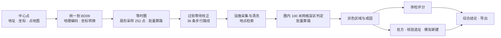

# 路遥识途 · 技术设计文档

> 对应交付要求里的「技术设计文档与报告」。文中数字来自 `data/samples/` 的两份快照（2026-10-04 生成）
> 和 `reports/` 下的实测报告，出处逐条注明。

| 交付要求 | 本文 | 详版与数据 |
| --- | --- | --- |
| 地图 API 调用策略 | 第 2 节 | [API 调用优化报告](api-optimization.md)、[对照实验数据](../reports/api-benchmark.md) |
| 等时圈生成算法（如何基于路网计算可达范围） | 第 3 节 | — |
| 多源 POI 数据清洗 | 第 4 节（含 AI 二次核对） | [二次召回核对](../reports/poi-crosscheck.md) |
| 服务盲区识别 | 第 5、6 节 | [小学按校门测距对照](../reports/school-gates.md) |
| 针对特定社区的真实对比测试 | 第 11 节 | [直线缓冲区 vs 真实路网](../reports/straight-line-comparison.md) |

## 1. 总体架构

- **后端**（`backend/app/`，FastAPI）分五块，彼此只通过数据结构交接：
  百度接口客户端（`baidu/`）、等时圈（`isochrone/`）、设施（`poi/`）、报告（`report/`）、共享标注（`markings/`）。
- **前端**（`frontend/src/`，React + Vite + 百度 JS API GL）。浏览器端 AK 由 `/api/config` 运行时下发，不编进静态产物，换 Key 不用重新构建。
- **实时分析**走 `POST /api/isochrone/stream`（SSE）：等时圈、设施、盲区、报告四个阶段各推一次结果，页面边算边画。
  超时（240 秒）或配额耗尽时，已推送的部分留在页面上。`POST /api/isochrone` 是同样结果的非流式版本。
- **首屏读快照**：`data/samples/` 的预生成结果零 API 消耗；打开时按当前口径重算报告，评分规则改了不必重新调接口。
- **本地数据**：
  - `.cache/`：百度回答的磁盘缓存与分析历史，可以随时清；
  - `data/user/`：共享标注与照片（SQLite），不是缓存，要单独备份；
  - `data/samples/`：随仓库分发的样例快照。

主要接口（完整列表见启动后的 `http://127.0.0.1:8000/docs`）：

| 接口 | 用途 |
| --- | --- |
| `GET /api/samples`、`GET /api/samples/{id}` | 样例列表与快照 |
| `POST /api/isochrone/stream`、`POST /api/isochrone` | 实时分析（流式 / 非流式） |
| `POST /api/simulate`、`POST /api/site-plan` | 模拟新建、核验选址 |
| `POST /api/recheck`、`POST /api/construction-candidates` | 复测巡检、工地候选 |
| `POST /api/crosscheck` | AI 二次核对：百度地图 Agent Plan 再找一遍缺口附近的关键设施 |
| `POST /api/narrate`、`POST /api/export`、`GET /api/samples/{id}/export` | 综合结论、导出 |
| `GET /api/demo` | 离线模拟，零 API 消耗 |
| `GET /api/geocode`、`GET /api/histories` | 地址转坐标、分析历史 |
| `/api/markings/*`、`/api/admin/*` | 共享标注与审核 |
| `GET /api/health`、`GET /api/config` | 健康检查、前端运行时配置 |

## 2. 地图 API 调用策略

完整的策略、对照实验与答辩问答见 [API 调用优化报告](api-optimization.md)。这里只列要点。

### 2.1 用到的接口

| 接口 | 用途 | 代码 |
| --- | --- | --- |
| 批量算路 `routematrix/v2/walking`（另有 riding、driving） | 等时圈采样、中心到各格的耗时、盲区判定、模拟新建、核验选址 | `baidu/client.py` 的 `route_matrix`、`route_matrix_grid` |
| 步行路线规划 `directionlite/v1/walking` | 过街等待校正、围挡核验、复测巡检 | `walking_route` |
| 地点检索 `place/v2/search` | 六类民生设施；小学加 `scope=2` 取导航点与校门；工地候选 | `search_poi`、`search_poi_all` |
| 地理编码、逆地理编码、坐标转换 | 地址定位、选址写地址、WGS84 / GCJ02 转 BD09 | `geocode`、`reverse_geocode`、`geoconv` |
| JS API GL（浏览器端） | 底图、等时圈与网格图层、3D 视角、卫星底图 | `frontend/src/baiduMap.ts` |

### 2.2 配额按点对计，所以先省点对

实测批量算路的日配额按**点对**计（约 140 次请求、共 2479 个点对时触发 `302`），单次请求的限制是
**起点数 × 终点数 ≤ 100**。所以装满请求只能少发请求，真正省配额要少测点对：

- **装满请求**：单起点多终点按 100 一批切开；多起点多终点按「起点数 × 终点数 ≤ 100」切成矩形块。
- **直线下界剪枝**：直线距离是步行距离的下界，直线就超过 1 公里的设施不进候选。
- **够近就停**：判定「1 公里内有没有」只要找到一家达标的，由近到远一轮轮测，找到就停。
- **按候选分组装箱**：同一轮里共用同一候选的网格并成一次「多起点 × 1 终点」请求。
- **按点对缓存、只补缺的点对**：坐标量化到 50 米（校门 10 米），每个点对单独存盘 30 天；补测时按「缺的终点集合」分组，已缓存的不重发。
- **一批采样插多个圈**：5、10 分钟内圈和「不计过街等待」的外圈都用同一批采样插值，零额外点对。

曹杨圈内 144 格的盲区判定（`reports/api-benchmark.md`，零配额回放，延迟假设 B）：

| 做法 | 点对 | 请求 | 模拟耗时 | 与全量矩阵结论一致 |
| --- | --- | --- | --- | --- |
| 逐对请求，串行 | 18720 | 18720 | 2.2 小时 | 100% |
| 全量矩阵（不剪枝），串行 | 19584 | 254 | 5.0 分钟 | 基准 |
| **现行（剪枝 + 够近就停 + 分组装箱，在途 3）** | **746** | **51** | **14.4 秒** | 99.3%（其余记「未知」，没有一格判反） |

缓存为空时一次完整分析：桃浦 486 个点对、曹杨 982 个，外加 36 次步行路线、20~45 次地点检索；同一地点重跑 0 个点对。

### 2.3 并发与限速

- 全局令牌桶 8 QPS（实测地理编码 12 并发全部成功、16 并发开始 401），大矩阵按点对数多占令牌；
- 批量算路最多 3 个在途（回放实验里 1 → 3 耗时减半，再往上收益很小），步行路线最多 4 个（实测 8 并发安全、12 触发限流）；
- httpx 连接池复用，重试退避带 ±50% 随机抖动，几路请求被限流后不会同一时刻一起重试；
- 盲区判定同一轮里互不相干的候选组并发测距，品类之间串行：三类同时跑会让几个大矩阵一起挤令牌桶；
- 两道闸门是**进程级**的：多人同时做实时分析，共享同一份额度，不会把接口打到限流，代价是各自变慢。样例、导出、健康检查不经过闸门。

### 2.4 容错与降级

总原则：**接口故障不能伪装成民生结论**。核心输出是「这里缺设施」，所以「没测到」必须和「没有」分开。

| 类别 | 状态码 | 处理 |
| --- | --- | --- |
| 瞬时噪声 | `401` `402` `1`、网络异常、JSON 解析失败 | 指数退避重试，最多 3 次 |
| 配额耗尽 | `301` `302` | 不重试。该接口当天熔断，错误一路上抛；302 在北京时间零点自动解除 |
| 配置错误 | `5` `102` `200` `210` `211` `220` `240` 等 | 不重试，按状态码说明原因（AK 类型、服务未勾选、IP 白名单……） |

- 某类设施检索失败（含某一页失败）：整类记「查询失败」，不当 0、不计分。半截结果也丢弃，因为它会让设施显得偏少。
- 网格测距失败：该格该类记「未知」，不算盲区；判定成功不到一半的品类不给盲区占比、不进评分。
- 等时圈采样有整批失败：不出圈（`IncompleteSamplingError`）。那些点是「没测到」，当成障碍会画出一个缩水的圈。
- 步行路线失败：该方向退回批量算路的耗时，标注「未校正」。
- 模拟新建、核验选址时配额用完：改按直线估算，结果标 `estimate_quota` 并写明原因。
- 没配服务端 AK：后端照常启动，样例、离线模拟、导出可用；`/api/health` 与页面顶部写明缺什么、怎么补。

报错一律写清四件事：**哪个服务**、**为什么**（302 当日超限、白名单、没配 AK……）、**停在哪一步、已完成的部分还在不在**、
**何时恢复、现在能做什么**。没有中断但做了降级的环节写进结果的 `warnings`，页面单列一张「这次分析有 N 处降级」卡片。

回放实验里注入 401 限流、网络中断、配额耗尽、检索失败四类故障，**没有一格被误判为盲区**，不一致的判定全是「已判定 → 未知」。

两条实测踩过的坑：

- 早期把 `302` 当限流重试：配额越接近耗尽，302 出现越频繁，每次失败又被放大成四次请求，形成正反馈。
- 反过来也踩过：「整块矩阵拿不到结果」先入为主当成 401 并发限流，调了半天限流参数，实际是 302 配额耗尽。
  两者表象相同、处置相反。现在客户端把整块失败的形状与状态码记进 `matrix_failures`，生成脚本直接打印。

## 3. 等时圈生成：扇形采样 + 射线插值

百度地图不提供等时圈接口，也不开放底层路网数据。本项目只用「批量算路」这一个原语逼近真实可达边界（`isochrone/algorithm.py`）。

### 3.1 算法

1. 以中心点为原点，按方位角均匀发射 36 条射线（每 10°；页面上可在 12~72 条之间调，时间阈值可在 5~30 分钟之间调）；
2. 每条射线上按半径梯度布置采样点：步行 200 / 400 / … / 1400 米共 7 档（骑行、驾车用更大的梯度）；
3. 252 个采样点按 100 一批提交批量算路（3 个请求），取回真实路网的步行距离与耗时；
4. 每个方向补一条步行路线规划，把过街与路口等待补回各点耗时（见 3.3）；
5. 每条射线从内往外扫，找到耗时**首次**超过阈值的区间，线性插值出边界半径；
6. 36 个边界半径做环形滑动平均（窗口 3），连成多边形。不计等待的圈同时保留，地图上画成虚线对比；
7. 用同一批采样再插出 5 分钟、10 分钟内圈，零额外请求。

三个关键取舍：

- **首次穿越而非最远可达**。某方向 600 米处超时、900 米处却达标（绕到了另一条通道），边界仍取 600 米。
  等时圈描述连通的可达区域，跨过不可达地带的「飞地」不计入。
- **失败点视为障碍而非跳过**。算路返回不可达时射线在此截断，标「障碍截断」。当作缺失值忽略，
  会让等时圈越过河道、铁路等真实屏障。扫到最外仍未超时的方向标「饱和」，说明真实边界可能更远。
- **查询失败绝不退化为 0**（见 2.4）。

为什么不铺满网格测：1.5 公里范围铺 50 米网格约 2800 个点，比扇形采样多一个数量级，而日配额只有约 2500 个点对。
扇形采样在边界附近最密，正好是求边界最需要的地方。

### 3.2 出行方式

等时圈默认是命题要求的**步行**。实时计算可切换：

| 方式 | 路网 | 额外计入的因素 | 不假装能做的事 |
| --- | --- | --- | --- |
| 步行 | 人行道、人行横道、天桥、地道 | 绕路；过街与路口等待（路线规划校正） | 不是信号灯实时相位 |
| 骑行 | 非机动车道 | 绕路；采样半径放到约 4.5 km | 不做过街校正；网格盲区按步行口径，故不铺 |
| 驾车畅通 | 车行道，tactics=13 | 完全畅通时的预计耗时 | 不含实时拥堵 |
| 驾车路况 | 常规路线，tactics=11 | 实时路况进入耗时（缓存 10 分钟） | 批量算路不含道路阻断图层 |

驾车路况的缓存是部分保留：10 分钟内视为实时直接复用；过期条目不删，接口失败时用最近一次的路况兜底，
并写明最旧的一条是多少分钟前的。

### 3.3 红绿灯、天桥与施工围挡

命题的痛点是「红绿灯、过街天桥、施工围挡都会极大影响实际步行可达范围」。三件事分开处理：

**绕路与天桥、地道：算进去了。** 批量算路沿真实路网走，路线距离是直线的 1.2~3.5 倍，绕到人行横道、天桥、地道过街多走的路都在距离里。

**红绿灯与路口等待：批量算路没有，另用路线规划补**（`isochrone/refine.py`）。2026-09-24 在曹杨实测，
步行批量算路的耗时恒等于路线距离 ÷ 约 1.17 m/s，14 组点对速度全在 1.17~1.18 m/s，等待一秒都没算。
而同一起终点的步行路线规划在「过马路」和主干道路段的步骤里带额外秒数，单次过马路约 +30 秒。于是每个方向补一条路线：

1. 以批量算路的中位步速 v0 为基准，每一步的额外等待 = max(0, 步骤耗时 − 步骤距离 / v0)；
2. 沿路线距离累加成延误剖面 D(s)，步内按距离线性分摊；
3. 同方向较近的采样点视为走这条路线的前段，校正耗时 t' = t + D(d)，再插值边界；
4. 热力网格按相邻两条射线的剖面、按角度加权补等待，不另耗配额。

效果：曹杨每公里约多出 82 秒，圈从 1.75 km² 缩到 1.41 km²；桃浦每公里约多出 36 秒，圈从 1.32 km² 缩到 1.18 km²。
这是百度路线模型给出的统计延误，不是某盏灯此刻的相位；路线取不到的方向退回批量算路的耗时并标注，不补 0。

**施工围挡：接口做不到，由用户标注。** 两个接口都不接收避让区域，百度也没有面向个人开发者的围挡数据。
用户在地图上放圆形围挡（10~300 米，最多 20 处）后重新计算：

- 等时圈：路线折线第一次进入围挡的位置记为受阻点，同方向更远的采样点按受阻截断；
- 盲区：围挡内的设施视为暂不可用；判为可达的「网格 → 设施」点对，若按椭圆条件
  （|A−C| + |C−B| − 2ρ ≤ 路线长度）路线可能经过围挡，就取一条步行路线核验，穿过围挡的换下一家候选，取不到路线的记「未知」；
- 热力：受阻方向上更远的格子显示为褐色。

这是保守判定：接口不能绕开围挡重新规划，真实情况可能有绕行，需要现场复核。

### 3.4 两条自动线索：找疑似，人确认

结果都只是候选，用户点「确认为围挡」才进入计算：

- **复测巡检**（`isochrone/recheck.py`，约 36 次步行路线规划，不占批量算路点对）：每次分析把各方向的路线存为基线。
  复测时对同样的起终点**跳过缓存**重新规划，路线变长超过 max(100 米, 8%) 的方向，沿旧路线找「从哪开始不再重合、到哪又重合」，
  被放弃的那段就是疑似受阻处；相邻方向落在 80 米内的合并成一处。路线变长也可能来自路网数据调整或门禁时段，所以只叫「疑似」。
  2026-09-27 对桃浦实测：36 个方向全部不变，12.9 秒，40 次请求（含 4 次限流重试）。
- **工地 POI**（`poi/construction.py`，2 次地点检索）：「工地」「施工」各查一页，筛掉建材店、装修公司、劳务招聘等，
  离某条步行路线不超过 60 米的排前面。桃浦实测 20 条结果筛掉 19 条，留下「景泰路道路新建工程项目部」。

### 3.5 局限

- 36 个方向相隔 10°，在 1 公里处两条射线相距约 175 米，夹在中间的窄通道或窄障碍可能测不到。
- 耗时随半径不单调时（绕过河后又变近），取「第一次超时」作为边界，更外侧的可达点不算进圈。
- 环形平均会把某个被障碍截断的方向向外拉一点，这是平滑和保真之间的取舍。

## 4. 多源 POI 数据清洗

### 4.1 品类与关键词（`poi/catalog.py`）

| 品类 | 检索关键词 | 关键设施（参与网格盲区判定） | 覆盖层权重 |
| --- | --- | --- | --- |
| 生鲜采买 | 菜市场、农贸市场、生鲜超市 | 是 | 1.4 |
| 医药 | 药店、药房 | 是 | 1.3 |
| 基础教育 | 小学 | 是（按校门测距） | 1.3 |
| 基础医疗 | 社区卫生服务中心、诊所、医院 | — | 1.1 |
| 养老服务 | 养老院、敬老院、社区养老服务中心、日间照料中心 | — | 1.0 |
| 文体休闲 | 公园、体育馆、图书馆、健身房 | — | 0.9 |

检索半径罩住中心 2.5 公里：圈边上的居民走 900 米就能到圈外的药店，漏采会凭空造出盲区。
关键品类每词最多翻 6 页（曹杨这样的密集街区，3 页 60 条会被截断）；翻页串行，拿到这一页、知道还有下一页才翻。

### 4.2 清洗规则（`poi/collect.py`）

一个品类对应多个关键词，提升召回的代价是同一设施被反复返回，还会混进名字相近的误召回：

| 问题 | 处置 | 实测效果 |
| --- | --- | --- |
| 多源重复 | 归一化名称 + 50 米坐标量化去重 | 曹杨「医药」原始 56 条去重掉 28 条 |
| 误召回 | 按品类黑名单拦名称 | 「小学」召回的「小学生辅导中心」被剔除 |
| 误召回（名字看不出） | 按百度的分类标签拦（`scope=2` 才有，目前用于小学） | 曹杨「上海市希望进修学院」分类为「成人教育」，被剔除 |
| 坐标缺失或为 0 | 直接剔除 | — |
| 「圈内」的口径 | 以落在等时圈多边形内为准，而不是圆形半径 | — |

名称归一化会剥掉「（兰溪路店）」这类后缀，所以必须叠加坐标，否则同品牌的两家门店会被误并成一家。
任一关键词、任一页检索失败，整个品类返回「查询失败」，不拿半截结果出结论。

### 4.3 小学按校门测，不按地图上的一个点测（`poi/entries.py`）

学校有面积，地点检索给的坐标常在校园中间；批量算路把终点吸附到离这个点最近的路上，那条路可能贴着围墙、根本没有门。
居民要走到的是校门：

- 地点检索加 `scope=2` 带回导航点（通常是正门，不多花请求），再按校名查一次拿到「东南 1 门」「北门」这类子点
  （每校 1 次地点检索，最多 30 所、由近到远，缓存 30 天）；停车场出入口不算；
- 入口相距不到 20 米的并成一个，每校最多 4 个；取不到入口的退回坐标点；
- 到一所学校的距离取到最近入口的步行距离，剪枝的直线下界、成因诊断也按入口算；
- 入口终点的缓存按 10 米量化，相距二三十米的两个门不会共用一个结果。

对照实验（`reports/school-gates.md`）：曹杨 18 所小学的入口离坐标点 34~102 米，缺小学的方格按点测 26 格、按门测 18 格。
变化是双向的：10 格由缺变成够得着（朝春中心小学的门开在东南，东侧居民按点测要 1032 米、按门只要 888 米），
也有 2 格由够得着变成缺（坐标点吸附到的那条路一侧并没有门）。桃浦 116 格结论不变。
药店是临街门店、菜市场没有可靠的入口数据，都按坐标点测。

### 4.4 AI 二次核对：第二条召回通道（`poi/crosscheck.py`）

关键词检索漏掉设施，会凭空造出盲区：「这里没有小学」可能只是关键词没查到。百度地图 Agent Plan 的
语义地点检索是另一条召回通道，按自然语言理解需求、按距离排序，正好拿来交叉核对。灰色区域卡片里的
「AI 二次核对」（`POST /api/crosscheck`，配置了 `BAIDU_MAP_AUTH_TOKEN` 才显示）：

1. 对每片编了号的灰色区域、每个缺的关键品类，以区域锚点为中心问一次「帮我找附近最近的小学」这类完整的需求句子；
   提问要带所在城市与区县，由中心点逆地理编码得到（如「上海市普陀区」）；
2. 返回的设施按百度的二级分类只留这一类的主点：学校的停车场、出入口这类子点，名字带「小学」的托管班都去掉；
3. 和结果里的同类设施逐个比对，同名 500 米内或相距 100 米内算同一家：
   - **已收录**：两条通道都找到了，结论有交叉印证；
   - **未收录、离缺口方格直线 1 公里内**：列为「疑似漏收录」；
   - **未收录、1 公里外**：步行只会更远，不影响结论；
4. 疑似漏收录的设施只是线索，不改结论：可以「按补录测一下」（就是模拟新建，对缺这一类、直线 1 公里内的方格做一次路网测距），
   或到现场确认后「共享为补录标注」（位置、类别、名称都带好，来源记为「AI 二次核对」，照片仍要现场拍）。

额度与容错：Agent Plan 按调用扣额度，回答缓存 30 天，同样的问题不再问；一次最多问 8 个问题，进程级每小时最多新问 60 个。
单个问题失败只记在那一行，写「没核对成功」，不当成「附近没有」；Token 被拒（401 / 403）时后面的问题不再问。
离线模拟结果不能核对（设施是伪造的）。Agent Plan 返回 GCJ02 坐标，按百度公开的公式在本地换算成 BD09。

`scripts/crosscheck_poi.py` 用同一个模块把两份样例逐片核对一遍，再按补录做路网实测，写成 `reports/poi-crosscheck.md`。
2026-10-04 共问 6 个问题：曹杨缺的都是小学，找到的小学全部已收录；桃浦发现 1 家漏收录的药房，按补录实测，
直线 1 公里内缺药店的 14 格步行 1 公里内一格也够不着，结论不变。

### 4.5 快照里放什么

随仓库分发的快照带设施名称和坐标（地图打点要用），不含电话和街道地址。POI 原始检索结果只在本地 `.cache/`，不入库、不分发。

## 5. 服务盲区识别

### 5.1 判定口径（`report/blindspot.py`）

命题要求识别「周边 1 公里内没有菜市场、药店或小学」的服务盲区。本项目的口径：

- 居民点：15 分钟步行圈内每 100 米一格（圈外不铺，桃浦 116 格、曹杨 144 格）；
- 判定：逐格实测**步行 1 公里**内能否到达菜市场、药店、小学，三类分别判；
- 设施集合：中心 2.5 公里内检索到的全部同类设施（圈外的也算，见 4.1）；
- 直线距离只作为数学下界用来免费剪枝，**从不用来判定「够得着」**：直线法恰恰会把「直线够近、走路绕远」的居民点漏判成有覆盖。

### 5.2 怎么判

1. 按直线距离（有校门的按最近的校门）给每格排出直线 1 公里内的候选；没有候选的格子直接判为缺失，零请求；
2. 每一轮，各格取下一家候选，共用同一候选的格子并成一个请求（有校门的是「格子 × 校门」），同一轮的各组并发发出；
3. 步行 ≤ 1 公里即判「有」，这一格这一类结束；否则下一轮换更远的候选；
4. 候选测完仍无一达标 → 盲区；最多 4 轮还没判定，或测距失败 → 「未知」，不算盲区；
5. 判为可达的点对若可能穿过围挡（3.3 的椭圆条件），取一条路线核验。

桃浦 348 个「网格 × 品类」里 246 个被直线下界零请求判定；曹杨设施密，第一轮就被最近的设施覆盖掉大半。

### 5.3 实测结果

桃浦镇（百分比为缺该类的格子占已判定格子）：

| 口径 | 方格 | 缺至少一类 | 菜市场 | 药店 | 小学 |
| --- | --- | --- | --- | --- | --- |
| 直线 1 公里 | 116 | 99 | 70.7% | 51.7% | 85.3% |
| **步行 1 公里（路网实测）** | 116 | **116** | **92.2%** | **81.0%** | **100%** |

直线口径漏掉了 17 个走不到的格子；整个 15 分钟圈都是盲区，没有一格记为「未知」。

曹杨新村：缺至少一类 18 格，全是小学（12.5%），菜市场、药店都是 0%。直线口径一格也查不出来：
这 18 格直线 1 公里内都有小学，只是走不过去。另有 3 格的菜市场测完 4 轮候选仍未判定，记「未知」，不计入占比。

## 6. 灰色区域与成因（`report/regions.py`）

- **成片**：缺任一类的格子按四邻接合并成片，勾出外框、按面积编号 A、B、C……（最多 12 片，其余记为零散盲区）。网格只铺在圈内，灰色区域也只出现在圈内。
- **逐类成因**：
  - 直线 1 公里内就有同类设施、步行却超过 1 公里 → **路网阻隔**（该打通），并写出往哪个方向、多远有哪一家；
  - 直线 1 公里内都没有 → **供给缺口**（该补设）；
  - 该品类检索失败 → 成因未知，不下结论。

实测：桃浦灰色区域 A 就是整个圈（116 格，约 1.16 km²），三类都以供给缺口为主、阻隔为辅
（小学 104 格对 12 格、菜市场 82 对 25、药店 60 对 34）；曹杨 3 片（A 15 格、B 2 格、C 1 格）全部是小学的路网阻隔，
往西、西南直线五六百米就有小学的校门，步行却要 1 公里以上。

## 7. 体检评分（`report/score.py`）

五维各 0~100，加权合成；没测的维度不计入，按参与项的权重和归一。85 分以上为优，70 以上良，55 以上中，其余为弱。

| 维度（权重） | 怎么算 | 满分基准 | 曹杨 | 桃浦 |
| --- | --- | --- | --- | --- |
| 路网可达（30%） | 等时圈面积 | 理想方格路网的菱形 2r²（15 分钟步行 2.33 km²） | 60.6 | 50.6 |
| 方向均衡（20%） | 最短 ÷ 最长方向半径 | 方格路网的 1/√2 ≈ 0.71 | 87.0 | 80.0 |
| 路径效率（15%） | 平均绕行系数，到 2.25 记 0 | 方格路网的 4/π ≈ 1.27 | 96.1 | 18.7 |
| 设施覆盖（20%） | 六类设施圈内有没有，按 4.1 的权重 | 六类都有 | 100 | 0 |
| 可达均衡（15%） | 1 − 三类关键设施盲区格占比的平均 | 没有盲区格 | 95.8 | 8.9 |
| **总分** | | | **84.4（良）** | **35.3（弱）** |

**路网三项为什么不拿直线当满分。** 以中心画圆、径直走过去是任何路网都到不了的上界。按它算时，
一个路网完全规整、设施全部走得到的社区也只有 80 分，「优」谁都拿不到（2026-10-04 校准前曹杨 69.5、桃浦 24.5）。
方格路网（曼哈顿距离）是规划里常用的参照：同样走 r 米，可达范围是面积 2r² 的菱形，最短方向（对角）÷ 最长方向（沿街）= 1/√2，
各方向绕行系数 |cos θ| + |sin θ| 的平均为 4/π。比它更好的（有斜路、放射路）封顶 100。
满分假设一路畅通，过街等待缩小的面积照常扣分；直线圆的对比单列为「直线法高估几倍」，不进评分。

## 8. 诊疗：处方、核验选址、模拟新建、综合结论

处方直接读灰色区域的逐格成因，**不另耗配额**（`report/prescribe.py`）：

- **路网阻隔 → 打通**：按「被哪一家挡在外面」分组，最大的一组写成处方：往哪个方向、直线多远有哪一家、现在步行要多远；
  再按本圈典型绕行系数（各方向实测绕行的中位数，夹在 1.2~1.8）估算打通后能消去几格，估算为 0 格的不开。
- **供给缺口 → 补设**：以全部网格为候选点做**最大覆盖贪心选址**，每次挑「按典型绕行折算后步行 1 公里能覆盖最多剩余缺口格」的一格，每类最多两处。
- 紧凑度过低 → 先处理路网切割；查询失败的品类不开方。
- 门槛按面积定：打通要求被同一家挡住的格子、补设要求一处能覆盖的缺口格，都够 0.12 km²（100 米网格 12 格）。
  一片阻隔区常被几所学校分着挡，所以打通也认「同一片灰色区域里这一类的阻隔格合计够大」。

实测：桃浦得到 3 条补设 + 1 条打通（往西直线 367 米就有一家药房，步行却要 1886 米）；
曹杨只开 1 条打通（往西南的朝春中心小学，估算打通后约 8 格进入步行 1 公里）。曹杨 A 片 15 格里离朝春最近的一组只有 11 格，
单看不够 12 格，A 片合计够，照样开出。

**核验选址**（`report/siteplan.py`）把补设的估算交给真实路网：取前几名备选点（彼此至少相隔 300 米），逐个跑一次模拟新建，
按实测消去的格数重排，给最好的一处用逆地理编码写出地址。总点对受预算约束（默认 360，命中缓存的不计）。

**模拟新建**（`report/simulate.py`）同样按步行口径：先用直线下界挑出缺这一类、且直线 1 公里内的候选方格，
再做一次「候选方格 × 拟建点」的批量算路，步行 1 公里内够得着的才消去。批量算路配额用完时改按直线估算并写明原因；
离线模拟数据只给直线估算的上限并如实标注。

**综合结论**（`narrate.py`）把评分、灰色区域与处方写成四段话：【总体结论】【主要问题】【诊疗建议】【数据边界】。
先从结果里抽出一份事实清单（只有统计数字、设施名称与方向，不含坐标），再按固定结构写出来，每个数字都直接取自清单。
打开结果就自动显示；不调用任何外部服务、不花配额，同一份结果永远是同一段话，导出的报告开头也是这一段。

## 9. 可视化与交互

- **中心点自定义**：搜索地址或小区名、直接输入坐标（可选 BD09 / GCJ02 / WGS84，非 BD09 先经百度坐标转换），或点地图任意位置重算；
  时间阈值、射线数、出行方式、是否计入过街等待都能在页面上调。
- **等时圈**：15 分钟外圈 + 5、10 分钟内圈，未计过街等待的圈画成虚线对比。
- **灰色区域**：默认图层把缺任一类的方格涂灰并编号，点编号弹出面积、格数与逐类成因；可切到单个品类。点任何一格，
  卡片写出每类缺的设施测过的最近步行距离、直线最近的是哪一家、属于哪种成因，并直接给出能做的标注。
- **步行耗时热力**（`lib/heatRaster.ts`）：网格耗时栅格化成「一格一像素」的小图放大绘制，由浏览器做双线性插值，
  颜色只在实测过的格子之间过渡，不在没测过的地方染色。色阶上限取两倍阈值；测距失败浅蓝、受围挡阻断褐色。
- **视角与底图**：一键 3D 倾斜、左右旋转、指北针回正、卫星影像底图、全屏，只用浏览器端 JS API，不花服务端配额。
  倾斜或旋转后画布色场对不上透视，热力改由地图逐格画矢量方格，贴着地面跟着转。
  试过又拿掉：实时路况图层（只画机动车道路，街区尺度几乎看不到，也和步行判定无关）、自动环绕（视角动画在 0°/360° 交界处倒转，和手动拖动打架）。
- **体检报告**：五维评分雷达、灰色区域与成因、自动诊疗、圈内设施覆盖条（深色圈内、浅色检索半径内，差值就是「附近有、走不进圈」）、
  逐类最近设施、过街等待与围挡说明、降级说明。
- **对比与历史**：两个地点并排对比；实时分析自动存历史，回看不花配额。
- **导出**：Markdown / CSV / GeoJSON / ZIP，后端按当前口径重算报告后打包，零 API 消耗。样例走 `GET /api/samples/{id}/export`；
  实时计算、历史记录、离线模拟走 `POST /api/export`（请求体 `{"feature": 当前结果, "format": "zip|md|geojson|csv|json"}`）。
  离线模拟的结果在报告头部注明「不代表真实路网」。

## 10. 用户共享标注

乡镇地区 POI 漏录、过时，路网缺小路，算法再准也只能在错的输入上推理。共享标注让用户纠正**输入**，
附近的人以任何中心点分析时都能用上。完整设计见 [用户标注设计方案](crowd-markings-design.md)。

| 类型 | 画法 | 分析时怎么用 |
| --- | --- | --- |
| 围挡 / 封路 | 地图上放圆（10~300 米） | 并进本次围挡：路线穿过即截断、围挡内设施不可用 |
| 设施失效 | 点设施标，选已关闭、不对外、位置或类别不对 | 从设施集合剔除（同名 50 米内匹配），缺这一类的格子重新判定 |
| 补录设施 | 在门口放点，选类别、填名称 | 加进设施集合，附近缺这一类的格子测距 |
| 灰色区域 | 沿边界画多边形（≤ 50 个顶点、≤ 1 km²） | 叠加层，记录「设施在但不够用」等算法看不出的原因，不改变判定 |

- **信任**：自己的标注立即对自己生效；别人的只有经管理员核实才自动计入，在那之前只作为建议，可逐条采纳。投票只影响排序与置信度。
- **审核不能一键**：要先打开详情并停留至少 5 秒、逐项确认、选核实依据并写意见、看过每张照片；不能核实自己提交的标注。
- **现场照片必填**：浏览器缩图后上传，服务端按文件头认格式、逐段去掉 EXIF / XMP 等元数据（手机照片常带拍摄地点）。
- **可撤销、可追溯**：每次修改存一版，事件日志只追加；结果里记下用了哪条标注的哪一版。
- **分析时**：先按纯算法算一遍，再叠加标注算一遍，第二遍测过的点对命中缓存。地图右上角「纯算法 / 含标注」即时切换，不重算。

现阶段没有账号，写接口只有按设备与 IP 的限流；**公开部署前应加登录与人机验证**（见 [SECURITY.md](../SECURITY.md)）。

## 11. 对比测试与验证

### 11.1 样例怎么选

样例不是设施越多越好：要同时展示覆盖统计与盲区识别，需要内部落差明显的社区。`scripts/pick_sample_area.py`
对上海市普陀区 10 个街道、镇做两阶段筛选（先测中心点，再对前 4 名做四向探点），桃浦镇的内部落差最大，选为主样例；
曹杨新村街道是配套成熟的老城区，作为对照。两个样例的中心点都可以在页面上改。

### 11.2 真实路网 vs 直线缓冲区

`scripts/compare_straight_line.py` 依据快照与本地缓存离线生成，零 API 消耗（[完整报告](../reports/straight-line-comparison.md)）：

| 样例社区 | 直线画圆 | 真实路网 | 真实 / 直线 | 平均绕行 | 直线圆内设施 | 等时圈内设施 |
| --- | --- | --- | --- | --- | --- | --- |
| 曹杨新村街道 | 3.664 km² | 1.413 km² | 39% | 1.31 | 70 | 34 |
| 桃浦镇 | 3.664 km² | 1.181 km² | 32% | 2.07 | 10 | **0** |

直线法判为「1 公里内有」的居民点里，实测走不到的比例：曹杨小学 12.5%；桃浦菜市场 73.5%、药店 60.7%、小学 100%。
桃浦的两种口径给出的不是精确度差异，而是相反的结论：一个说配套尚可，一个说六个品类在真实可达范围内全部缺失。

### 11.3 其他实测报告

| 报告 | 内容 | 生成方式 |
| --- | --- | --- |
| [api-benchmark.md](../reports/api-benchmark.md) | 盲区判定五种做法、各环节、在途数、延迟假设、故障注入 | `scripts/benchmark_api.py`，回放真实缓存，零配额 |
| [school-gates.md](../reports/school-gates.md) | 小学按校门与按坐标点测距的对照 | `scripts/probe_facility_entries.py` |
| [poi-crosscheck.md](../reports/poi-crosscheck.md) | 关键设施的第二通道召回核对 | `scripts/crosscheck_poi.py` |
| [straight-line-comparison.md](../reports/straight-line-comparison.md) | 直线缓冲区 vs 真实路网 | `scripts/compare_straight_line.py`，零配额 |

接口能力边界（矩阵形状、日配额、并发上限、单次往返）的实测汇总在 [API 调用优化报告](api-optimization.md) 第 4 节。

### 11.4 自动化测试与 CI

- 后端 pytest 232 个（2026-10-04），全部用假客户端或 `httpx.MockTransport`，不联网、不花配额；
  覆盖等时圈插值、过街校正、盲区判定与围挡核验、灰色区域、评分、处方、标注的权限与审核关卡、照片去元数据、导出等。
- `scripts/verify.py` 一键验收：密钥扫描 + ruff lint + ruff 格式检查 + pytest + 前端 lint / 类型检查 / 构建，和 GitHub Actions 跑同一套检查。
- 回放实验的可信度：把真实运行开始前的缓存装进回放，现行做法实发的点对数与快照里记录的真实值相等（桃浦 12 = 12、曹杨 301 = 301），逐格判定 100% 一致。

## 12. 已知局限

- 过街等待是百度路线模型的统计延误，不是信号灯实时相位；围挡靠用户标注，接口不能绕开围挡重新规划。
- 36 个方向之间的窄通道可能测不到；耗时随半径不单调时取第一次超时。
- 盲区只看「1 公里内有没有」，不看设施容量与服务人口（[设计方案](crowd-markings-design.md) 第 11 节列了 G2SFCA、人口加权等改进方向）。
- 网格不区分有没有人住，工业区、水面的格子和居住区一样算。
- 共享标注没有账号体系，公开部署前要补登录与人机验证。
- 接口层还可以改进的几处（按原因记重试、地理编码缓存、短时断路器等）列在 [API 调用优化报告](api-optimization.md) 第 5 节。
